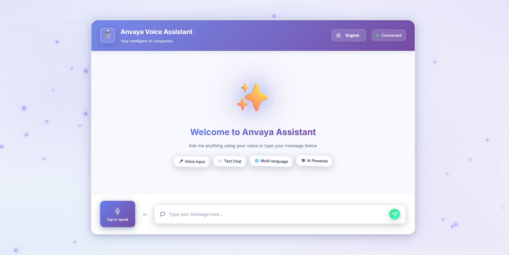

# 🎙️ Anvaya Voice Assistant

<div align="center">



**A modern, professional AI voice assistant with beautiful 3D UI and multi-language support**

[](https://www.python.org/)
[](https://fastapi.tiangolo.com/)
[](https://ai.google.dev/)

</div>

---

## ✨ Features

### 🎨 **Modern 3D UI**
- Beautiful rounded corners with depth effects
- Interactive 3D background with floating particles
- Smooth animations and transitions
- Glassmorphism design with elegant gradients
- Responsive design for all screen sizes

### 🚀 **Core Functionality**
- **FastAPI Backend** - High-performance REST API
- **Gemini API Integration** - Powered by Google's Gemini for chat and transcription
- **Modern Frontend** - HTML/CSS/JavaScript (no Gradio dependency)
- **Browser TTS** - Web Speech API for natural voice synthesis
- **Multi-language Support** - English and Hindi (हिंदी)
- **Real-time Voice Input** - Record and transcribe audio instantly
- **Configurable** - Easy setup via `.env` file

### 🎯 **User Experience**
- Intuitive voice and text input
- Real-time status indicators
- Smooth typing animations
- Interactive hover effects
- Professional error handling

---

## 🚀 Quick Start

### Prerequisites
- Python 3.8 or higher
- Gemini API key ([Get one here](https://ai.google.dev/))

### Installation

```bash
# Clone the repository
git clone https://github.com/po0mpomm/AI-Voice-Agent.git
cd AI-Voice-Agent

# Create virtual environment
python -m venv .venv

# Activate virtual environment
# Windows PowerShell:
.\.venv\Scripts\Activate.ps1
# Windows CMD:
.venv\Scripts\activate.bat
# Linux/Mac:
source .venv/bin/activate

# Install dependencies
pip install -r anvaya-voice-agent/requirements.txt

# Set up environment variables
copy example.env .env  # Windows
# or
cp example.env .env    # Linux/Mac

# Edit .env and add your Gemini API key
# GEMINI_API_KEY=your_api_key_here
```

### Running the Application

```bash
# Start the server
python run_server.py

# Or using the CLI
python -m anvaya_voice_agent.cli server

# With custom options
python -m anvaya_voice_agent.cli server --host 0.0.0.0 --port 8080 --reload
```

Then open your browser to **`http://127.0.0.1:8000`** 🎉

---

## ⚙️ Configuration

Create a `.env` file in the project root with the following variables:

```env
GEMINI_API_KEY=your_gemini_api_key_here
GEMINI_CHAT_MODEL=gemini-2.5-flash
GEMINI_STT_MODEL=gemini-2.5-flash
LOGGING_LEVEL=INFO
```

### Available Models
- `gemini-2.5-flash` (Recommended - Fast and efficient)
- `gemini-1.5-pro` (More powerful, slower)
- `gemini-1.5-flash` (Balanced option)

---

## 📁 Project Structure

```
AI-Voice-Agent/
├── backend/                    # FastAPI backend
│   ├── __init__.py
│   ├── app.py                 # Main FastAPI application
│   ├── config.py              # Settings management
│   ├── schemas.py             # Pydantic models
│   └── services/
│       └── gemini_client.py   # Gemini API client
│
├── frontend/                  # Modern web frontend
│   ├── index.html             # Main HTML page
│   ├── app.js                 # Frontend logic
│   ├── styles.css             # Styling with 3D effects
│   ├── animations.js           # Interactive animations
│   └── threejs-scene.js       # 3D background scene
│
├── src/
│   └── anvaya_voice_agent/    # Package source
│       ├── cli.py             # Command-line interface
│       └── ...
│
├── run_server.py              # Simple server launcher
├── example.env                # Environment template
├── screenshot.png             # Project screenshot
└── README.md                  # This file
```

---

## 🔌 API Endpoints

| Method | Endpoint | Description |
|--------|----------|-------------|
| `GET` | `/` | Serves the frontend HTML page |
| `GET` | `/health` | Health check endpoint |
| `POST` | `/api/chat` | Chat completion endpoint |
| `POST` | `/api/transcribe` | Audio transcription endpoint |

### Example API Usage

```bash
# Health check
curl http://127.0.0.1:8000/health

# Chat completion
curl -X POST http://127.0.0.1:8000/api/chat \
  -H "Content-Type: application/json" \
  -d '{
    "messages": [{"role": "user", "content": "Hello!"}],
    "language": "en"
  }'

# Audio transcription
curl -X POST http://127.0.0.1:8000/api/transcribe \
  -F "file=@audio.webm" \
  -F "language=en"
```

---

## 🎨 UI Features

### 3D Effects
- **Rounded Corners** - Modern, soft design
- **Depth Shadows** - Layered shadows for 3D depth
- **Hover Animations** - Interactive 3D transforms
- **Perspective** - CSS 3D transforms for depth

### Interactive Background
- Floating geometric shapes
- Animated particle system
- Dynamic gradients
- Mouse-responsive camera movement

### User Interface
- **Welcome Screen** - Beautiful onboarding experience
- **Feature Tags** - Interactive 3D tags
- **Voice Input** - Large, prominent microphone button
- **Text Input** - Modern input with send button
- **Message Bubbles** - Rounded, elevated message cards

---

## 🌐 Multi-language Support

### Supported Languages
- **English** (en) - Full support
- **Hindi** (हिंदी) (hi) - Full support

### Adding Hindi Voice (Windows)
For Hindi text-to-speech, you may need to install Hindi voice packs. See [HINDI_VOICE_SETUP.md](HINDI_VOICE_SETUP.md) for detailed instructions.

---

## 🛠️ Development

### Running in Development Mode

```bash
# With auto-reload
python run_server.py
# or
python -m anvaya_voice_agent.cli server --reload
```

### Project Migration
This project has been migrated from Gradio to FastAPI + HTML/CSS/JS. See [MIGRATION_SUMMARY.md](MIGRATION_SUMMARY.md) for details.

---

## 🐛 Troubleshooting

| Issue | Solution |
|-------|----------|
| `GEMINI_API_KEY` missing | Add your API key to `.env` file |
| Port 8000 already in use | Use `--port` flag to specify different port |
| Frontend not loading | Ensure `frontend/` directory exists with all files |
| Audio transcription fails | Check browser microphone permissions |
| Hindi voice not working | Install Hindi TTS voices (see HINDI_VOICE_SETUP.md) |
| CORS errors | Backend is configured to allow all origins |

---

## 📝 CLI Commands

```bash
# Start server
python -m anvaya_voice_agent.cli server

# Custom host and port
python -m anvaya_voice_agent.cli server --host 0.0.0.0 --port 8080

# Development mode with auto-reload
python -m anvaya_voice_agent.cli server --reload

# Custom log level
python -m anvaya_voice_agent.cli server --log-level DEBUG
```

---

## 🎯 Key Technologies

- **Backend**: FastAPI, Python 3.8+
- **AI/ML**: Google Gemini API
- **Frontend**: HTML5, CSS3, JavaScript (ES6+)
- **3D Graphics**: Three.js
- **Styling**: Modern CSS with 3D transforms
- **API Client**: httpx
- **Configuration**: pydantic-settings

---


## 🙏 Acknowledgments

- [Google Gemini API](https://ai.google.dev/) for AI capabilities
- [FastAPI](https://fastapi.tiangolo.com/) for the web framework
- [Three.js](https://threejs.org/) for 3D graphics

---

## 📧 Contact

For issues, questions, or contributions, please open an issue on [GitHub](https://github.com/po0mpomm/AI-Voice-Agent/issues).

---

<div align="center">

**Made with ❤️ by Anvaya**

⭐ Star this repo if you find it helpful!

</div>
